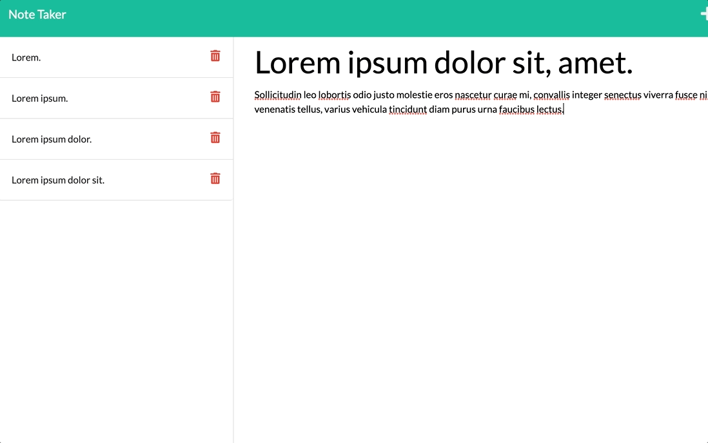

# express-note-taker


  
 


## Description 

Intuitive Note Taker that allows the user to write and save notes! Live deployed on Heroku.

## User Story

```
AS A small business owner
I WANT to be able to write and save notes
SO THAT I can organize my thoughts and keep track of tasks I need to complete
```

## Table of Contents 
* [Photos](#screenshots)
* [Installation](#installation)
* [Usage](#usage)
* [Technology](#technology)
* [Features](#features)
* [License](#license)
* [Socials](#questions)

## Photos




## Installation

`git clone` this repository to your local machine.

Install dependencies:
`npm install`
 
To start the application, run `node server.js` in the command line, then open http://localhost:8000 in your preferred browswer. 

## Usage 

This project can be used to generate a collection of notes which can be removed when no longer needed. 

## Technology

Technology used in the development of this app:

[](#)

[](#)

[](https://www.javascript.com/)

[](https://nodejs.org/en/)

[](https://whatwg.org/)

[](https://www.w3.org/TR/CSS/#css)

## Features

- Uses express.js to create and run a server
- Updates a JSON file when creating and deleting profiles
- Has a functional API
- Utilizes modularization


## License

MIT License

---

## Questions?


Reach out with any questions!

GitHub: [emiliatrentham](https://github.com/emiliatrentham)


[](https://www.linkedin.com/in/emilia-trentham-987a59164/)